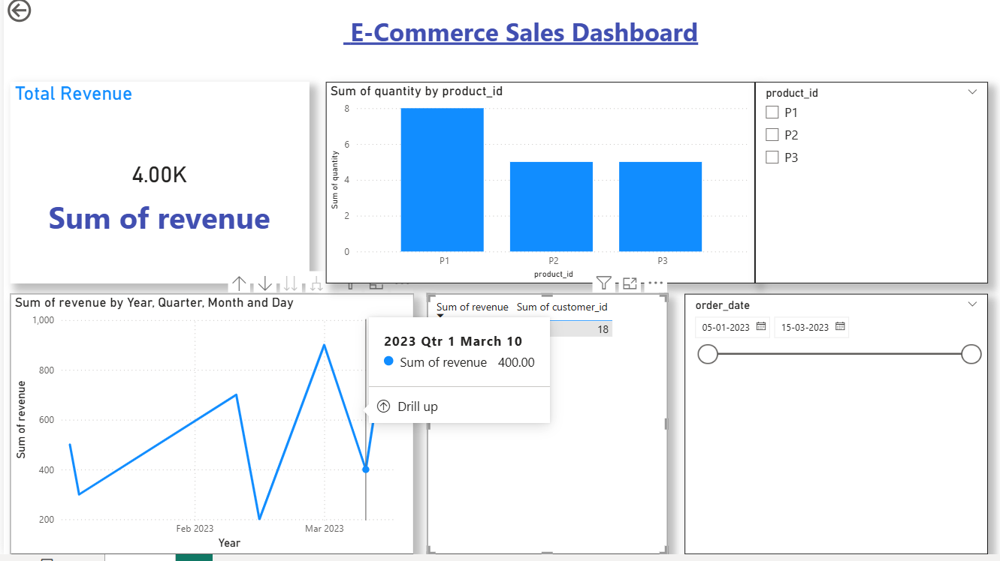

# 🛒 E-Commerce Sales Dashboard

## 📊 Project Overview

This project analyzes e-commerce sales data and builds an interactive Power BI dashboard.

## 🚀 Features

* Total Revenue Analysis
* Product-wise Sales
* Time-based Trends (Year, Month)
* Interactive Filters (Date, Product)

## 🧰 Tech Stack

* Python (Data Cleaning)
* PostgreSQL (Database)
* Power BI (Dashboard)
* GitHub (Deployment)

## 📁 Project Structure

* data/ → raw & cleaned data
* python/ → scripts
* sql/ → database queries
* dashboard/ → Power BI file
* screenshots/ → dashboard preview

## 📸 Dashboard Preview

## 🔥 Insights

* Revenue trends fluctuate over months
* Some products perform better consistently
* Seasonal spikes observed

## 📌 Author

Naveen D
